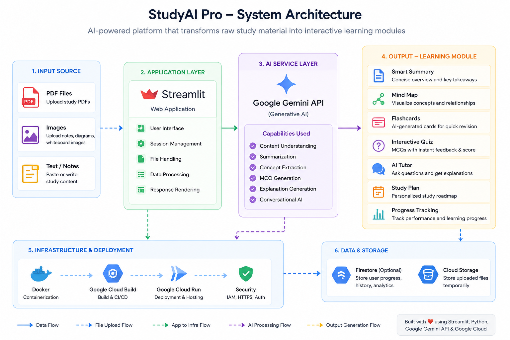

# 🎓 StudyAI Pro

> Transform notes, PDFs, and study materials into interactive AI-powered learning experiences within seconds.


---

# 🚀 Live Demo

🔗 Live Application

https://aiseekho-study-app-346509650305.us-central1.run.app

---

# 🎥 Demo


---

# 📖 Overview

StudyAI Pro is an AI-powered learning assistant that converts raw study material into structured, interactive learning modules.

Students can upload PDFs, images, lecture notes, or text content and instantly receive:

* Smart summaries
* Concept explanations
* Visual mind maps
* Interactive flashcards
* AI-generated quizzes
* Personalized AI tutoring
* Study plans
* Progress tracking

Instead of spending hours creating revision resources manually, StudyAI Pro automatically generates everything needed for efficient learning and exam preparation.

---

# 🎯 Problem Statement

Students often spend significant time:

* Reading lengthy notes
* Creating summaries
* Building flashcards
* Preparing practice questions
* Organizing study plans

This process is repetitive and time-consuming.

StudyAI Pro leverages Generative AI to automate the entire learning workflow, transforming static study material into engaging and personalized learning experiences.

---

# ✨ Core Features

| Feature              | Description                                            |
| -------------------- | ------------------------------------------------------ |
| 📄 PDF Processing    | Upload lecture notes and study documents               |
| 🖼️ Image Processing | Learn directly from whiteboard or handwritten images   |
| 📝 Smart Summaries   | Generate concise topic summaries                       |
| 🧠 Visual Mind Maps  | Understand concept relationships visually              |
| 🎴 Flashcards        | AI-generated revision cards                            |
| 🎯 Interactive Quiz  | Auto-generated MCQs with instant scoring               |
| 🤖 AI Tutor          | Ask questions related to uploaded material             |
| 📅 Study Planner     | Personalized learning roadmap                          |
| 📈 Progress Tracking | Monitor quiz performance and progress                  |
| 🌙 Dark Mode         | Modern learning experience for extended study sessions |

---

# 🖼️ Screenshots

## Home Screen


---

## Generated Learning Module


---

## Mind Map Visualization


---

## Flashcards


---

## Interactive Quiz


---

## AI Tutor


---

## Personalized Study Plan


---

## Progress Dashboard


---

## Dark Mode


---

# 🏗️ System Architecture



### Workflow

1. User uploads study material
2. Content is processed and analyzed
3. Google Gemini extracts concepts
4. Structured learning module is generated
5. Interactive learning resources are created

Generated outputs include:

* Summary
* Mind Map
* Flashcards
* Quiz
* AI Tutor
* Study Plan
* Progress Dashboard

---

# 🛠️ Technology Stack

## Frontend

* Streamlit

## Backend

* Python

## AI Layer

* Google Gemini API

## Deployment

* Google Cloud Run

## Data Processing

* JSON Parsing
* PDF Extraction
* Image Analysis

---

# 📊 Project Highlights

* Built using Google Gemini API
* Deployed on Google Cloud Run
* Supports PDF, Image, and Text inputs
* Generates complete study modules automatically
* Includes AI Tutor and Progress Tracking
* Fully responsive interface
* Dark Mode support
* Developed during AI Seekho 2026
* Focused on improving learning efficiency

---

# 📦 Installation

## Clone Repository

```bash
git clone https://github.com/lakeshkumarkhatri/studyai-pro.git

cd studyai-pro
```

## Create Virtual Environment

```bash
python -m venv venv
```

## Activate Environment

### Windows

```bash
venv\Scripts\activate
```

### Linux / macOS

```bash
source venv/bin/activate
```

## Install Dependencies

```bash
pip install -r requirements.txt
```

## Configure Environment Variables

Create a `.env` file:

```env
GEMINI_API_KEY=YOUR_API_KEY
```

## Run Application

```bash
streamlit run app.py
```

Application will be available at:

```text
http://localhost:8501
```

---

# ☁️ Deployment

This application is deployed using Google Cloud Run.

Deploy manually:

```bash
gcloud run deploy studyai-pro \
--source . \
--region us-central1 \
--allow-unauthenticated
```

---

# 🎯 Use Cases

### Students

* Exam preparation
* Concept understanding
* Quick revision

### Universities

* Interactive learning resources
* Course content transformation

### Self Learners

* Accelerated learning workflows
* Structured knowledge acquisition

### Professionals

* Certification preparation
* Technical knowledge revision

---

# 🔮 Future Roadmap

Planned improvements:

* Multi-language support
* Voice-based AI tutor
* PDF annotation support
* Learning analytics dashboard
* Gamification system
* Achievement badges
* Study streak tracking
* Collaborative study rooms
* Practice exam generator
* Mobile application

---

# 🏆 AI Seekho 2026 Project

StudyAI Pro was developed as part of the AI Seekho 2026 program.

The project explores how Generative AI can improve education by transforming traditional study materials into personalized and interactive learning experiences.

---

# 👨‍💻 Author

## Lakesh Kumar

Software Engineering Student

🌐 Portfolio
https://lakeshkumar.vercel.app

💼 LinkedIn
https://www.linkedin.com/in/lakesh-kumar

💻 GitHub
https://github.com/lakeshkumarkhatri

---

# ⭐ Support

If you found this project useful:

* ⭐ Star the repository
* 🍴 Fork the project
* 💡 Share feedback
* 🤝 Connect on LinkedIn

Contributions, ideas, and suggestions are always welcome.

---

### Built with ❤️ using Python, Streamlit, Google Gemini, and Google Cloud Run.
