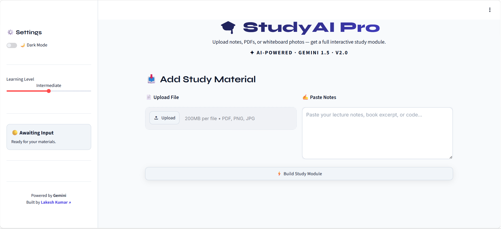
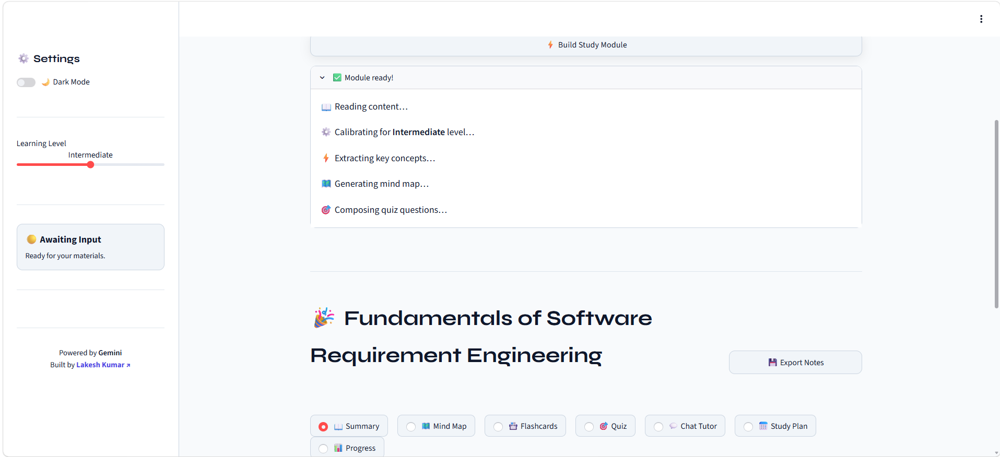
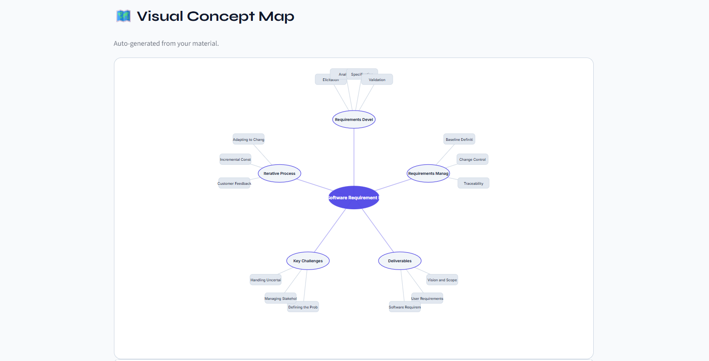
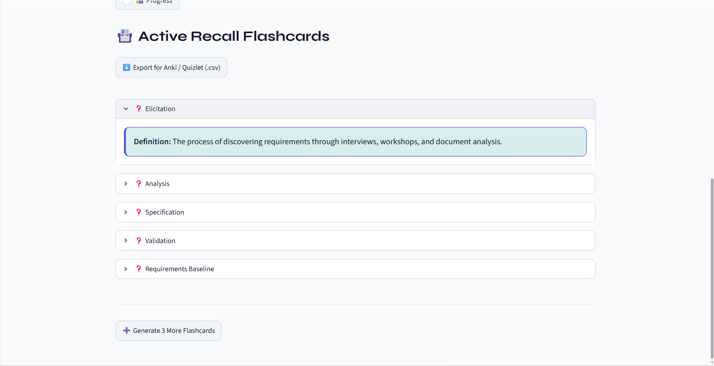
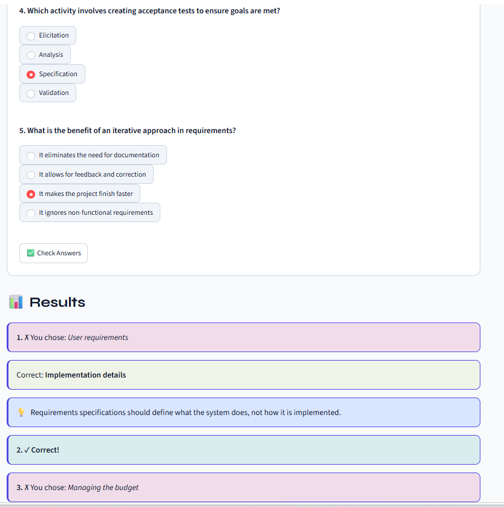
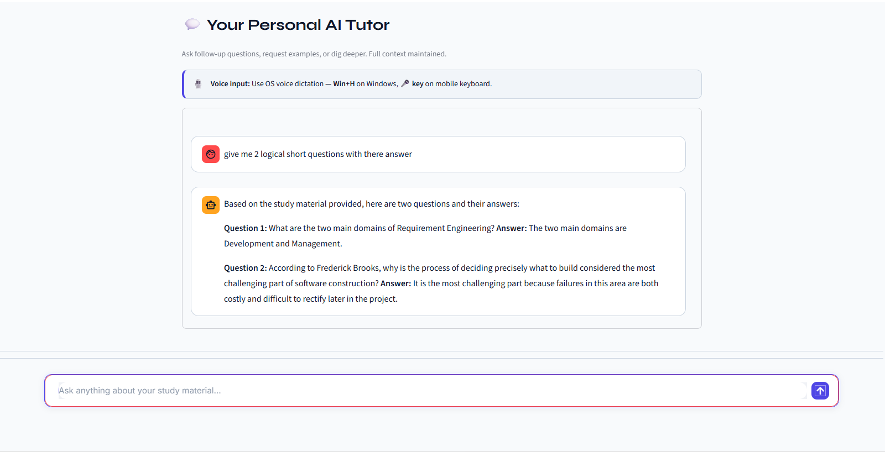
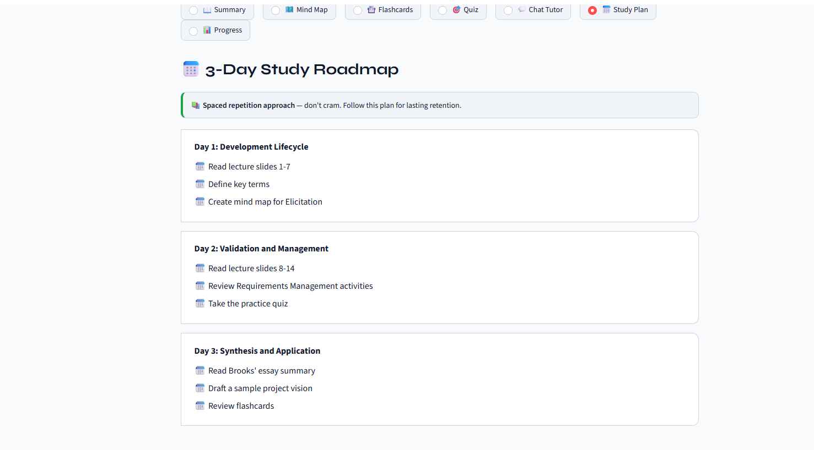
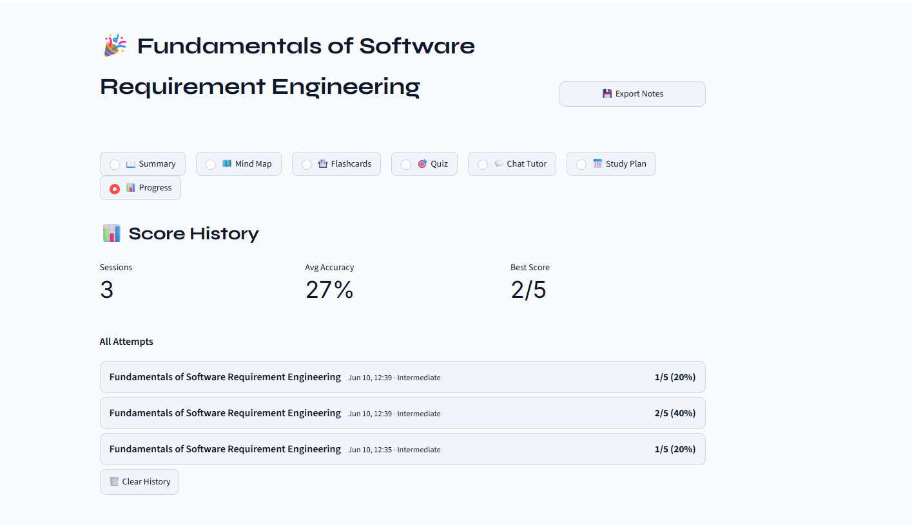
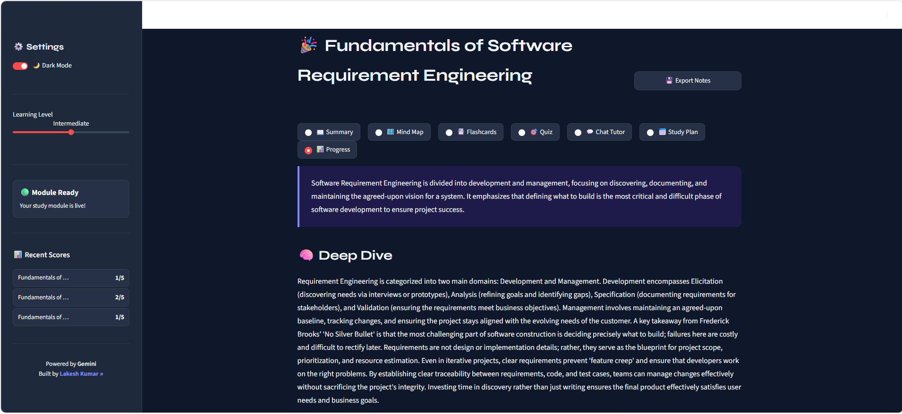

# 🎓 StudyAI Pro

> Transform notes, PDFs, and study materials into an interactive AI-powered learning experience.


---

## 🚀 Live Demo

🔗 **Live Application**

https://aiseekho-study-app-346509650305.us-central1.run.app

---

## 📖 Overview

StudyAI Pro is an AI-powered study assistant that converts raw study material into structured learning modules.

Students can upload PDFs, images, lecture notes, or plain text and instantly receive:

- Smart summaries
- Concept explanations
- Visual mind maps
- Interactive flashcards
- AI-generated quizzes
- Personal AI tutor
- Study plans
- Progress tracking

The goal is to reduce passive reading and turn study material into active learning experiences.

---

## ✨ Features

### 📄 Study Material Processing

Upload:

- PDF files
- Images (PNG/JPG)
- Lecture notes
- Text content

The application extracts key concepts and creates a complete learning module.

---

### 📝 Smart Summary

Automatically generates:

- Topic overview
- Key concepts
- Important takeaways

Helping students quickly understand the subject.

---

### 🧠 Visual Mind Maps

Creates concept maps showing:

- Core ideas
- Relationships
- Learning hierarchy
- Topic structure

Useful for revision and visual learners.

---

### 🎴 Flashcards

AI generates flashcards automatically.

Each flashcard contains:

- Term
- Definition
- Explanation

Ideal for quick revision sessions.

---

### 🎯 Interactive Quiz

Generates MCQs with:

- Multiple options
- Instant feedback
- Score calculation
- Result analysis

Students can test their understanding immediately.

---

### 🤖 Personal AI Tutor

Ask questions about the uploaded study material.

Examples:

- Explain this concept
- Give examples
- Simplify this topic
- Generate practice questions

The tutor remains focused on the current learning module.

---

### 📅 Personalized Study Plan

Creates learning roadmaps based on:

- Learning difficulty
- Topic complexity
- Study objectives

Helping students prepare efficiently.

---

### 📈 Progress Tracking

Tracks:

- Quiz performance
- Learning activity
- Study completion progress

Encouraging consistent learning habits.

---

### 🌙 Dark Mode

Modern dark mode interface for comfortable learning during long study sessions.

---

## 🖼️ Screenshots

### Home Screen



---

### Generated Learning Module



---

### Mind Map



---

### Flashcards



---

### Interactive Quiz



---

### AI Tutor



---

### Study Plan



---

### Progress Dashboard



---

### Dark Mode



---

## 🏗️ Architecture

```text
User Input
      │
      ▼
PDF / Image / Notes
      │
      ▼
Google Gemini API
      │
      ▼
Structured Learning Module
      │
 ┌────┼────┬────┬────┬────┐
 ▼    ▼    ▼    ▼    ▼
Summary
Mind Map
Flashcards
Quiz
AI Tutor
Study Plan
Progress
```

---

## 🛠️ Technology Stack

### Frontend

- Streamlit

### AI Layer

- Google Gemini API

### Backend

- Python

### Deployment

- Google Cloud Run

### Data Processing

- JSON
- PDF Parsing
- Image Processing

---

## 📦 Installation

### Clone Repository

```bash
git clone https://github.com/lakeshkumarkhatri/studyai-pro.git

cd studyai-pro
```

### Create Virtual Environment

```bash
python -m venv venv
```

### Activate Environment

Windows:

```bash
venv\Scripts\activate
```

Linux/Mac:

```bash
source venv/bin/activate
```

### Install Dependencies

```bash
pip install -r requirements.txt
```

### Set Environment Variable

Create a `.env` file:

```env
GEMINI_API_KEY=YOUR_API_KEY
```

### Run Application

```bash
streamlit run app.py
```

---

## ☁️ Deployment

This project is deployed using Google Cloud Run.

Deploy manually:

```bash
gcloud run deploy studyai-pro \
--source . \
--region us-central1 \
--allow-unauthenticated
```

---

## 🎯 Use Cases

- University students
- Exam preparation
- Self-learning
- Professional certification study
- Quick revision sessions
- Interactive learning environments

---

## 🔮 Future Improvements

- Multi-language support
- Voice interaction
- PDF annotations
- Advanced analytics
- Study streak system
- Gamification
- Collaborative study rooms
- AI-generated practice exams

---

## 🏆 Project Background

StudyAI Pro was developed during the Google AI Seekho 2026 program.

The project explores how Generative AI can improve education by transforming static study material into engaging, personalized learning experiences.

---

## 👨‍💻 Author

### Lakesh Kumar

Software Engineering Student

🔗 Portfolio: [https://lakeshkumar.netlify.app](https://lakeshkumar.vercel.app/)

🔗 LinkedIn: [https://linkedin.com/in/lakeshkumar](https://www.linkedin.com/in/lakesh-kumar)

🔗 GitHub: https://github.com/lakeshkumarkhatri

---

## ⭐ Support

If you found this project useful:

- Star the repository
- Share feedback
- Connect on LinkedIn

Contributions and suggestions are welcome.
